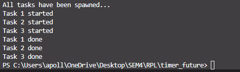

# Module 10 – Asynchronous Programming (Rust)

## Experiment 1.1: Original Timer from Book

In this experiment, I implemented a custom executor and a `TimerFuture` that completes after a delay. The executor drives the future to completion.

### Result:
- The message `"howdy from Ade’s Komputer!"` is printed.
- After a 2-second pause, `"done!"` is printed.
- This confirms that the future is lazily evaluated and only progresses when polled by the executor.

### Output:

---
## Experiment 1.2: Understanding How It Works

### Changes Made:
- Added `println!("Task has been spawned...")` after spawning the async task.

### Explanation:
- Futures in Rust are lazy. They do nothing until `.poll()` is called.
- The task is spawned but not executed until `executor.run()` begins polling.
- The printed message after `.spawn()` confirms that the task is registered, but does not yet run.

### Output:

---
## Experiment 1.3: Multiple Spawn and Removing `drop`

### Test Cases:
- Spawned 3 timer tasks with different durations using a loop.
- Temporarily removed `drop(spawner)` to observe behavior.

### 💡 Observations:
- Without `drop(spawner)`, the executor never terminates. This is because it waits for more tasks, not knowing the sender is done.
- Restoring `drop(spawner)` signals to the executor that no more tasks will be added, so it stops when the queue is empty.

### Output:
**With drop:**

**Without drop:**

---